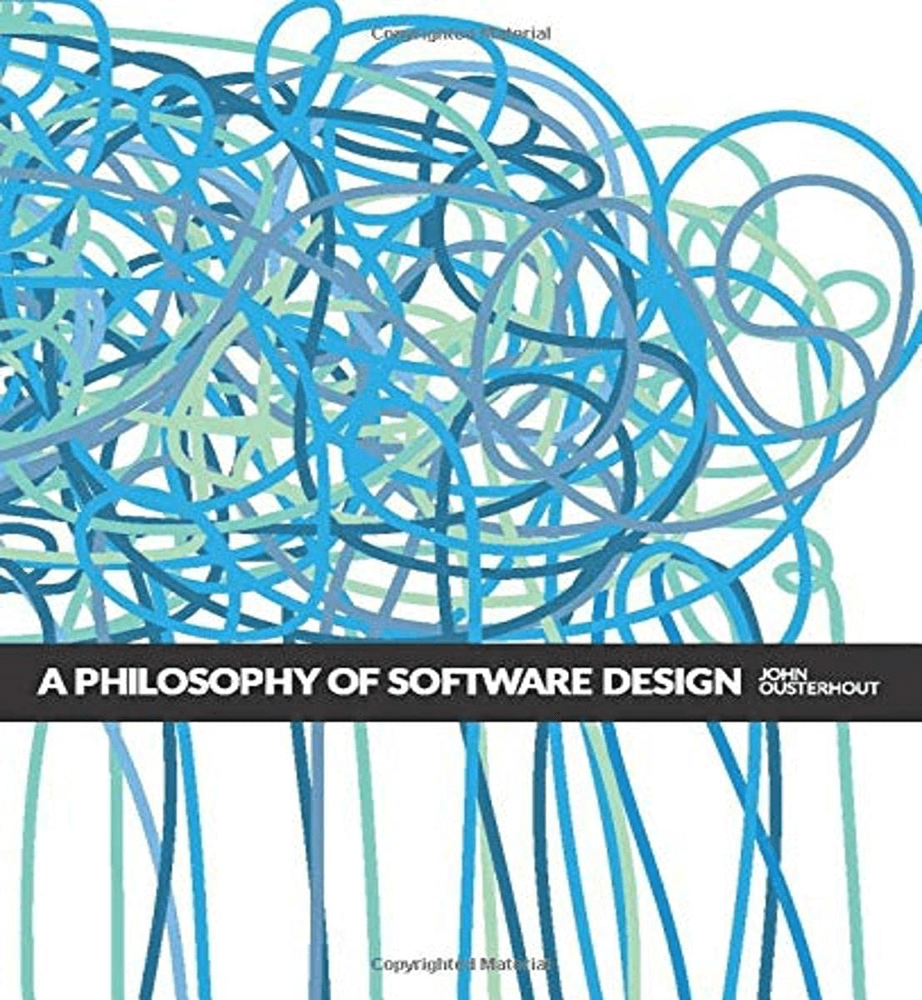

# A-Philosophy-of-Software-Design 中文版

《软件设计哲学》(2018-2021) by John Ousterhout



## 原版地址

- 2018 英文第一版，在线地址：https://milkov.tech/assets/psd.pdf
- 2021 英文第二版，新增内容：https://web.stanford.edu/~ouster/cgi-bin/aposd2ndEdExtract.pdf

## 作者

[John Ousterhout](https://web.stanford.edu/~ouster/cgi-bin/home.php) 是斯坦福大学的 Bosack Lerner 计算机科学教授。他是 Tcl 脚本语言的创建者，并且以在分布式操作系统和存储系统中的工作而闻名。Ousterhout 在耶鲁大学获得了物理学学士学位，并在卡内基梅隆大学获得了计算机科学博士学位。他是美国国家工程院院士，并获得了无数奖项，包括 ACM 软件系统奖，ACM Grace Murray Hopper 奖，美国国家科学基金会总统年轻研究者奖和 UC Berkeley 杰出教学奖。

## how to build

```shell
cargo install mdbook
cargo install mdbook-epub

mdbook build
mdbook serve
```
